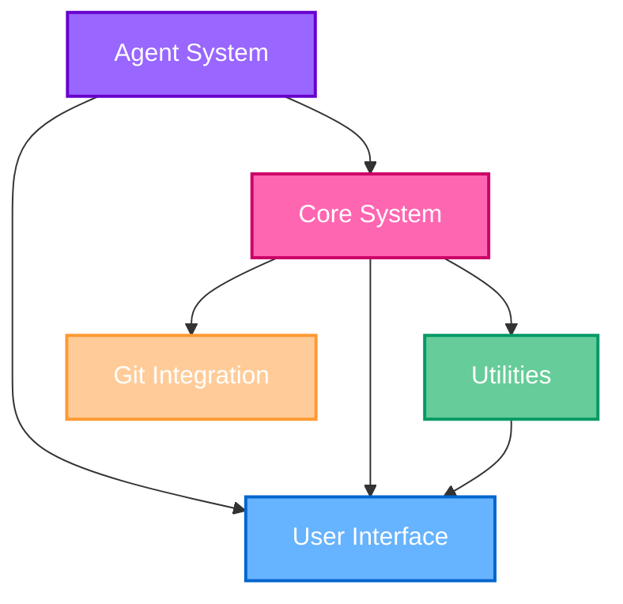
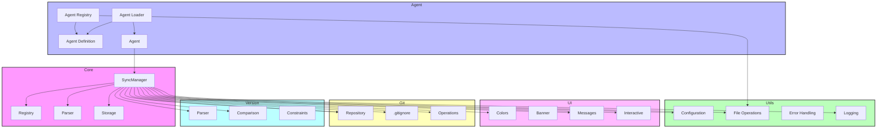

# API Reference

> 🧩 This section provides documentation for the internal APIs of cursor++ that can be used by developers extending the tool.

## Overview

The cursor++ tool is built with extensibility in mind, featuring a modular architecture with well-defined APIs between components. This documentation covers the public interfaces that can be used when:

1. Extending cursor++ with new functionality
2. Developing plugins or integrations
3. Understanding how the internals work

## API Stability

The API stability follows semantic versioning principles:

- **Stable APIs**: Functions and types marked with `// Stable` comments are guaranteed not to change in ways that break existing code within the same major version. These are safe to use in extensions.

- **Internal APIs**: Functions and types marked with `// Internal` may change between minor versions. Use these with caution and be prepared to update your code when upgrading cursor++.

- **Experimental APIs**: Functions and types marked with `// Experimental` are still under development and may change significantly or be removed in any version. These are not recommended for use in production extensions.

## Core Modules

cursor++ is organized into the following core modules, each with its own API:

| Module | Package | Description | Stability |
|--------|---------|-------------|-----------|
| [Agent System](./agent-api.md) | `cursor++/internal/agent` | Agent discovery, loading, and management | Stable |
| [Core](./core-api.md) | `cursor++/internal/core` | Core functionality for rule management | Stable |
| [UI](./ui-api.md) | `cursor++/internal/ui` | Terminal UI components | Stable |
| [Utils](./utils-api.md) | `cursor++/internal/utils` | Utility functions and helpers | Stable |
| [Git](./git-api.md) | `cursor++/internal/git` | Git repository operations | Stable |
| [Version](./version-api.md) | `cursor++/internal/version` | Version management | Stable |

## Getting Started with the API

If you're developing extensions or integrations with cursor++, start by understanding the core concepts and how the different modules interact. The following diagram shows the high-level relationships between the main API components:



*Figure 1: High-level API relationships*

## Common Patterns

When working with the cursor++ API, you'll encounter several common patterns:

### Error Handling

All functions that can fail return errors alongside their results:

```go
result, err := function()
if err != nil {
    // Handle error
}
```

### Context Propagation

Many APIs accept a context as their first parameter for cancellation and value propagation:

```go
ctx := context.Background()
result, err := function(ctx, param1, param2)
```

### Builder Pattern

Complex objects often use the builder pattern for construction:

```go
builder := NewBuilder().
    WithOption1("value").
    WithOption2(123)
    
instance, err := builder.Build()
```

## Extension Points

cursor++ provides several extension points for adding new functionality:

1. **Custom Agents**: Create new agent definitions in `.mdc` files
2. **Hooks**: Register functions to be called at specific points in the execution flow
3. **UI Components**: Create custom UI components for specialized displays
4. **Command Extensions**: Add new subcommands or flags to the CLI

## API Documentation Navigation

- [Agent API](./agent-api.md): Agent discovery, loading, and management
- [Core API](./core-api.md): Core functionality for rule management
- [UI API](./ui-api.md): Terminal UI components
- [Utils API](./utils-api.md): Utility functions and helpers
- [Git API](./git-api.md): Git repository operations
- [Version API](./version-api.md): Version management

## Example: Using the Agent API

Here's a quick example of using the Agent API to load and use an agent:

```go
package main

import (
    "context"
    "fmt"
    "log"
    
    "cursor++/internal/agent"
)

func main() {
    // Create a context
    ctx := context.Background()
    
    // Initialize the agent registry
    registry, err := agent.NewRegistry()
    if err != nil {
        log.Fatalf("Failed to create agent registry: %v", err)
    }
    
    // Load agents from the default location
    agents, err := registry.LoadAgents(ctx)
    if err != nil {
        log.Fatalf("Failed to load agents: %v", err)
    }
    
    // Find a specific agent by ID
    wizard, exists := registry.GetAgentByID("wizard")
    if !exists {
        log.Fatalf("Wizard agent not found")
    }
    
    // Print agent details
    fmt.Printf("Agent: %s (v%s)\n", wizard.Name, wizard.Version)
    fmt.Printf("Description: %s\n", wizard.Description)
}
```

## Notes for API Users

When using the cursor++ API:

1. Always check for breaking changes when upgrading to a new version
2. Follow best practices for error handling and context propagation
3. Consider backwards compatibility if you're building extensions that others will use
4. Contribute improvements and bug fixes back to the main project

## API Structure

The APIs are organized according to the internal package structure of the cursor++ codebase:

```
internal/
├── agent/     -> Agent API
├── core/      -> Core API
├── git/       -> Git API
├── ui/        -> UI API
├── utils/     -> Utils API
└── version/   -> Version API
```

Each API corresponds to a specific internal package and provides the functionality described in the [Code Structure](../developer-guide/code-structure.md) documentation.

## Core Components

| Component | Description |
|-----------|-------------|
| [Core API](./core-api.md) | Central functionality for rule parsing, storage, and synchronization |
| [Agent API](./agent-api.md) | Agent definition, loading, and management |
| [Utils API](./utils-api.md) | Utility functions for configuration, file operations, and more |
| [UI API](./ui-api.md) | Terminal UI components and styling utilities |
| [Git API](./git-api.md) | Git repository interaction and management |
| [Version API](./version-api.md) | Version parsing, comparison, and management |

## Core API

The [Core API](./core-api.md) provides the central functionality of cursor++, including:

- **SyncManager**: Handles agent rules initialization
- **Registry**: Manages project registration and rule tracking
- **UI Components**: Terminal-based user interface elements

## Agent API

The [Agent API](./agent-api.md) handles all agent-related functionality:

- `AgentDefinition`: Structure representing an agent definition
- `Agent`: Runtime representation of an agent
- `Registry`: Manages agent registration and discovery
- `Loader`: Loads agent definitions and creates agent instances

## Utils API

The [Utils API](./utils-api.md) provides utility functions used throughout the application:

- Configuration management
- File system operations
- Error handling
- Logging utilities
- Terminal UI helpers

## UI API

The [UI API](./ui-api.md) includes components for building the terminal user interface:

- Color utilities
- Banner and message functions
- Interactive selectors
- Confirmation prompts
- Progress indicators

## Git API

The [Git API](./git-api.md) provides Git integration utilities:

- Repository detection
- .gitignore management
- Git operations (commit, pull, push)
- Repository information

## Version API

The [Version API](./version-api.md) handles version parsing and comparison:

- Semantic version parsing
- Version comparison
- Version constraints
- Version ranges

## Architecture Overview

The following diagram illustrates the relationships between the major components:



## Type Reference

The following are key types defined across the cursor++ system:

| Type | Package | Description |
|------|---------|-------------|
| `Agent` | `agent` | Represents an AI agent with specific capabilities |
| `Registry` | `agent` | Manages agent loading and selection |
| `SyncManager` | `core` | Handles initialization of agent rules directory |
| `Config` | `utils` | Configuration settings for the application |
| `UI` | `ui` | Terminal-based user interface components |
| `Rule` | `core` | Represents a rule definition |
| `AgentDefinition` | `agent` | Represents an agent definition |
| `Selector` | `ui` | Interactive list selector |
| `RepositoryInfo` | `git` | Information about a Git repository |
| `Version` | `version` | Semantic version representation |

## Function Reference

Some of the most commonly used functions:

| Function | Package | Description |
|----------|---------|-------------|
| `SyncRules` | `core` | Synchronizes rules between projects |
| `ParseRules` | `core` | Parses rule files into rule structures |
| `StoreRules` | `core` | Stores rules to the filesystem |
| `LoadAgent` | `agent` | Loads an agent by ID |
| `GetAppPaths` | `utils` | Gets application paths |
| `PrintBanner` | `ui` | Prints the application banner |
| `IsGitRepository` | `git` | Checks if a path is in a Git repository |
| `Parse` | `version` | Parses a version string |
| `InitProject` | `core` | Initializes a new cursor++ project |
| `MergeRules` | `core` | Merges rules from multiple sources |

## Error Handling

The cursor++ system uses a consistent error handling approach:

1. Functions return explicit error values
2. Errors are wrapped with additional context
3. UI components display user-friendly error messages
4. Detailed errors are logged for debugging

Example of proper error handling:

```go
err := core.SyncRules(source, destination)
if err != nil {
    if errors.Is(err, core.ErrNoRulesFound) {
        ui.PrintWarning("No rules found to sync")
        return nil
    }
    return fmt.Errorf("failed to sync rules: %w", err)
}
```

## Best Practices

When working with the cursor++ API:

1. Always check error returns
2. Use the UI components for consistent user experience
3. Handle file operations carefully to avoid data loss
4. Provide clear feedback to users during long operations
5. Follow existing patterns for extending functionality

## Contributing

If you're contributing to the cursor++ codebase, please follow these guidelines:

1. Maintain backward compatibility when modifying public APIs
2. Add comprehensive tests for new functionality
3. Update documentation when changing behavior
4. Follow Go best practices for error handling and function design

---

## Navigation

- Previous: [Developer Guide](../developer-guide/README.md)
- Next: [Core API](./core-api.md)
- Up: [Documentation Home](../README.md)
- Home: [Documentation Home](../README.md) 