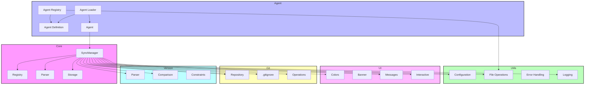

# API Reference

> 📘 Comprehensive API documentation for the crules project.

## Overview

This API reference provides detailed information about the internal APIs of crules. It covers the following components:

- [Core API](./core-api.md): Core functionality for rule management and synchronization
- [Agent API](./agent-api.md): Agent system for managing AI agent definitions
- [UI API](./ui-api.md): User interface components and terminal interactions
- [Utils API](./utils-api.md): Utility functions and helpers
- [Git API](./git-api.md): Git integration utilities
- [Version API](./version-api.md): Version information and management

## API Structure

The APIs are organized according to the internal package structure of the crules codebase:

```
internal/
├── agent/     -> Agent API
├── core/      -> Core API
├── git/       -> Git API
├── ui/        -> UI API
├── utils/     -> Utils API
└── version/   -> Version API
```

Each API corresponds to a specific internal package and provides the functionality described in the [Code Structure](../developer-guide/code-structure.md) documentation.

## Core Components

| Component | Description |
|-----------|-------------|
| [Core API](./core-api.md) | Central functionality for rule parsing, storage, and synchronization |
| [Agent API](./agent-api.md) | Agent definition, loading, and management |
| [Utils API](./utils-api.md) | Utility functions for configuration, file operations, and more |
| [UI API](./ui-api.md) | Terminal UI components and styling utilities |
| [Git API](./git-api.md) | Git repository interaction and management |
| [Version API](./version-api.md) | Version parsing, comparison, and management |

## Core API

The [Core API](./core-api.md) provides the central functionality of crules, including:

- `SyncManager`: Synchronizes rules between projects and main location
- `Registry`: Manages registered projects
- `Parser`: Parses rule files from various sources
- `Storage`: Stores rules to the filesystem

## Agent API

The [Agent API](./agent-api.md) handles all agent-related functionality:

- `AgentDefinition`: Structure representing an agent definition
- `Agent`: Runtime representation of an agent
- `Registry`: Manages agent registration and discovery
- `Loader`: Loads agent definitions and creates agent instances

## Utils API

The [Utils API](./utils-api.md) provides utility functions used throughout the application:

- Configuration management
- File system operations
- Error handling
- Logging utilities
- Terminal UI helpers

## UI API

The [UI API](./ui-api.md) includes components for building the terminal user interface:

- Color utilities
- Banner and message functions
- Interactive selectors
- Confirmation prompts
- Progress indicators

## Git API

The [Git API](./git-api.md) provides Git integration utilities:

- Repository detection
- .gitignore management
- Git operations (commit, pull, push)
- Repository information

## Version API

The [Version API](./version-api.md) handles version parsing and comparison:

- Semantic version parsing
- Version comparison
- Version constraints
- Version ranges

## Architecture Overview

The following diagram illustrates the relationships between the major components:



## Type Reference

The following are key types defined across the crules system:

| Type | Package | Description |
|------|---------|-------------|
| `SyncManager` | `core` | Manages rule synchronization between projects |
| `Registry` | `core` | Manages project registration |
| `Rule` | `core` | Represents a rule definition |
| `AgentDefinition` | `agent` | Represents an agent definition |
| `Agent` | `agent` | Runtime representation of an agent |
| `Config` | `utils` | Application configuration |
| `Colors` | `ui` | ANSI color codes for terminal styling |
| `Selector` | `ui` | Interactive list selector |
| `RepositoryInfo` | `git` | Information about a Git repository |
| `Version` | `version` | Semantic version representation |

## Function Reference

Some of the most commonly used functions:

| Function | Package | Description |
|----------|---------|-------------|
| `SyncRules` | `core` | Synchronizes rules between projects |
| `ParseRules` | `core` | Parses rule files into rule structures |
| `StoreRules` | `core` | Stores rules to the filesystem |
| `LoadAgent` | `agent` | Loads an agent by ID |
| `GetAppPaths` | `utils` | Gets application paths |
| `PrintBanner` | `ui` | Prints the application banner |
| `IsGitRepository` | `git` | Checks if a path is in a Git repository |
| `Parse` | `version` | Parses a version string |

## Error Handling

The crules system uses a consistent error handling approach:

1. Functions return explicit error values
2. Errors are wrapped with additional context
3. UI components display user-friendly error messages
4. Detailed errors are logged for debugging

Example of proper error handling:

```go
err := core.SyncRules(source, destination)
if err != nil {
    if errors.Is(err, core.ErrNoRulesFound) {
        ui.PrintWarning("No rules found to sync")
        return nil
    }
    return fmt.Errorf("failed to sync rules: %w", err)
}
```

## Best Practices

When working with the crules API:

1. Always check error returns
2. Use the UI components for consistent user experience
3. Handle file operations carefully to avoid data loss
4. Provide clear feedback to users during long operations
5. Follow existing patterns for extending functionality

## Contributing

If you're contributing to the crules codebase, please follow these guidelines:

1. Maintain backward compatibility when modifying public APIs
2. Add comprehensive tests for new functionality
3. Update documentation when changing behavior
4. Follow Go best practices for error handling and function design

---

## Navigation

- Previous: [Developer Guide](../developer-guide/README.md)
- Next: [Core API](./core-api.md)
- Up: [Documentation Home](../README.md)
- Home: [Documentation Home](../README.md) 