# Architecture

> 🏗️ This document describes the high-level architecture of the cursor++ tool and how its components interact.

## Overview

The cursor++ tool is designed with a modular architecture that separates concerns between different components. The architecture follows these key principles:

1. **Command-driven interface**: Core functionality is exposed through a hierarchical command structure
2. **Separation of concerns**: Each component has a specific responsibility
3. **Extensibility**: The system is designed to be extended with new capabilities
4. **Configuration management**: Central configuration that persists user settings

## System Architecture


*Figure 1: High-level architecture of the cursor++ system*

The system is organized into several interconnected components that work together to provide the functionality of cursor++. The interactive diagram below represents the high-level architecture with color-coded components:

```mermaid
graph TD
    User((👤 User)):::user --> CLI[/Command Line Interface\]:::cli
    
    subgraph Core["🔧 Core System"]
        CLI --> Init[Initialize]:::command
        CLI --> Config[Configure]:::command
        CLI --> AgentCmd[Agent Commands]:::command
        
        AgentCmd --> AgentList[List Agents]:::agentOp
        AgentCmd --> AgentSelect[Select Agent]:::agentOp
        AgentCmd --> AgentInfo[Agent Info]:::agentOp
        
        Init --> AgentRegistry[(Agent Registry)]:::registry
        
        AgentRegistry --> FileOps[File Operations]:::fileOp
    end
    
    subgraph Storage["💾 Storage"]
        AgentFiles[("📁 Agent\nDefinitions")]:::storage <--> FileOps
        ConfigFile[("⚙️ Configuration\nFile")]:::storage <--> Config
    end
    
    subgraph UI["🖥️ User Interface"]
        AgentSelect --> TermUI{Terminal UI}:::ui
        AgentList --> TermUI
        AgentInfo --> TermUI
    end
    
    %% Enhanced style definitions
    classDef user fill:#ff9966,stroke:#ff6600,stroke-width:2px,color:#333,font-weight:bold
    classDef cli fill:#66b3ff,stroke:#0066cc,stroke-width:2px,color:#333,font-weight:bold
    classDef command fill:#ffcc99,stroke:#ff9933,stroke-width:2px,color:#333
    classDef agentOp fill:#cc99ff,stroke:#9933ff,stroke-width:2px,color:#333
    classDef registry fill:#ff99cc,stroke:#ff3399,stroke-width:2px,color:#333
    classDef fileOp fill:#99ccff,stroke:#3399ff,stroke-width:2px,color:#333
    classDef storage fill:#99ff99,stroke:#33cc33,stroke-width:2px,color:#333
    classDef ui fill:#ffff99,stroke:#cccc00,stroke-width:2px,color:#333,font-weight:bold
    
    %% Style assignment for subgraphs
    style Core fill:#f0f0ff,stroke:#9999cc,stroke-width:2px,color:#333,font-weight:bold
    style Storage fill:#f0fff0,stroke:#99cc99,stroke-width:2px,color:#333,font-weight:bold
    style UI fill:#fffff0,stroke:#cccc99,stroke-width:2px,color:#333,font-weight:bold
```



*Figure 2: Interactive diagram of system components and their relationships*

## Key Components

### Command Line Interface (CLI)


*Figure 3: Command Line Interface component*

The CLI component provides the user interface for the tool. It:
- Processes command line arguments
- Manages the command hierarchy
- Handles input/output formatting
- Provides help and documentation

The CLI is implemented using the Cobra library, which provides a structured approach to defining commands, subcommands, and flags.

<details>
  <summary>📺 View CLI Interaction Example</summary>
  
  
  
</details>

### Core System

The core system implements the main functionality of the tool:

| Component | Responsibility | Key Functions |
|-----------|----------------|---------------|
| **Agent Registry** | Manages agent information | Discover, list, and select agents |
| **Configuration** | Manages user settings | Load, save, and validate configuration |
| **File Operations** | Handles file system interaction | Read, parse, and validate agent files |

### Agent System


*Figure 4: Agent System architecture*

The Agent System is a specialized component that:
- Discovers available agents from agent definition files
- Manages agent metadata and capabilities
- Provides selection and loading of agents
- Handles agent persistence

The Agent System has the following subcomponents:
- **Registry**: Manages the collection of available agents
- **Parser**: Extracts agent information from agent definition files
- **Selector**: Provides an interactive UI for agent selection
- **Loader**: Loads agent definitions for use

The detailed flow of the agent selection process is illustrated in the diagram below:

```mermaid
flowchart TD
    %% Define the main flow
    Start([🚀 Start]):::start --> Command["💻 cursor++ agent select"]:::command
    Command --> LoadConfig["⚙️ Load Configuration"]:::process
    LoadConfig --> ScanAgents["🔍 Scan for Agent Files"]:::process
    ScanAgents --> ExtractMeta["📋 Extract Agent Metadata"]:::process
    ExtractMeta --> BuildMenu["🖥️ Build Selection Menu"]:::process
    BuildMenu --> DisplayUI["👁️ Display Terminal UI"]:::ui
    
    %% User interaction
    DisplayUI --> UserSelect{"🤔 User Selection"}:::decision
    UserSelect -->|"Choose Agent"| ValidAgent["✅ Valid Agent Selected"]:::valid
    UserSelect -->|"Cancel"| NoSelection["❌ No Selection Made"]:::invalid
    
    %% Process selection
    ValidAgent --> SaveConfig["💾 Save Selected Agent to Config"]:::process
    SaveConfig --> LoadAgent["📂 Load Agent Definition"]:::process
    LoadAgent --> Complete([🎉 Complete]):::end
    
    %% Handle no selection
    NoSelection --> ExitNoChange["🚫 Exit Without Changes"]:::process
    ExitNoChange --> Exit([🚪 Exit]):::end
    
    %% Error handling branch
    ScanAgents -->|"No Agents Found"| NoAgents["⚠️ No Agents Found"]:::error
    NoAgents --> CreatePrompt["❓ Initialize Agents?"]:::decision
    CreatePrompt -->|"Yes"| InitAgents["📝 Initialize Agents"]:::process
    CreatePrompt -->|"No"| Exit
    InitAgents --> Command
    
    %% Styles
    classDef start fill:#4CAF50,stroke:#45a049,stroke-width:2px,color:white,font-weight:bold
    classDef end fill:#607D8B,stroke:#546E7A,stroke-width:2px,color:white,font-weight:bold
    classDef command fill:#2196F3,stroke:#1E88E5,stroke-width:2px,color:white
    classDef process fill:#9C27B0,stroke:#8E24AA,stroke-width:2px,color:white
    classDef decision fill:#FF9800,stroke:#F57C00,stroke-width:2px,color:white
    classDef valid fill:#4CAF50,stroke:#45a049,stroke-width:2px,color:white
    classDef invalid fill:#F44336,stroke:#E53935,stroke-width:2px,color:white
    classDef error fill:#F44336,stroke:#E53935,stroke-width:2px,color:white
    classDef ui fill:#00BCD4,stroke:#00ACC1,stroke-width:2px,color:white
    
    %% Add tooltips for better accessibility
    linkStyle 0,1,2,3,4,5,6,7,8,9,10,11,12,13,14,15,16 stroke-width:2px,fill:none,stroke:#9E9E9E
    
    %% Add a title
    subgraph "🤖 Agent Selection Process"
    Start
    end
    style "🤖 Agent Selection Process" fill:#ECEFF1,stroke:#CFD8DC,stroke-width:2px,color:#263238,font-weight:bold
```

*Figure 5: Detailed flowchart of the agent selection process*

<details>
  <summary>📺 View Agent Selection Process</summary>
  
  
  
</details>

### Storage Layer

The storage layer manages the persistence of agents and configuration:

| Storage Location | Purpose | Content |
|------------------|---------|---------|
| **Agent Definitions** | Store agent definitions | Agent definition files (.mdc) |
| **Configuration File** | User settings | Environment variables configuration data |

## Data Flow

### Agent Initialization Flow


*Figure 6: Agent initialization flow*

The agent initialization process follows a sequential flow as illustrated in this diagram:

```mermaid
sequenceDiagram
    participant User as 👤 User
    participant CLI as 🖥️ CLI
    participant Core as 🔧 Core System
    participant MainLoc as 📁 Main Location
    
    %% Define styles using note annotations
    note over User: fill:#ff9966,stroke:#ff6600
    note over CLI: fill:#66b3ff,stroke:#0066cc
    note over Core: fill:#cc99ff,stroke:#9933ff
    note over MainLoc: fill:#99ff99,stroke:#33cc33
    
    %% Sequence starts
    User->>+CLI: 🚀 Execute Init Command
    CLI->>+Core: 📥 Process Command
    
    %% Loading phase
    Core->>Core: 🔍 Load Configuration
    
    %% Main location setup
    Core->>User: ❓ Prompt for Main Location
    
    alt Clone from Git Repository
        User->>Core: 🔗 Provide Git URL
        Core->>+MainLoc: 📦 Clone Repository
        MainLoc-->>-Core: ✅ Clone Confirmation
    else Create Empty Directory
        User->>Core: 📁 Choose Empty Directory
        Core->>+MainLoc: 🆕 Create Directory Structure
        MainLoc-->>-Core: ✅ Creation Confirmation
    end
    
    %% Agent loading
    Core->>+MainLoc: 📂 Scan Files
    MainLoc-->>-Core: 📋 Agent File List
    
    %% Completion phase
    Core-->>-CLI: 📊 Init Results
    CLI-->>-User: ✅ Display Success
    
    %% Final confirmation
    Note over User,MainLoc: 🎉 Initialization Complete!
```



*Figure 7: Sequence diagram showing the initialization workflow*

The initialization process follows these steps:

1. **Initialization**:
   - User invokes `cursor++ init` command
   - System loads configuration
   - System prompts user for main location setup options

2. **Main Location Setup**:
   - User chooses to create an empty directory or clone from Git
   - System sets up the main location based on user choice
   - Directory structure is created for agent definitions

3. **Agent Loading**:
   - System scans the main location for agent definition files
   - Agents are loaded and validated
   - System registers the available agents

4. **Reporting**:
   - System summarizes the initialization results
   - User receives confirmation of successful initialization

<details>
  <summary>📺 View Initialization Process</summary>
  
  
  
</details>

### Agent Selection Flow

The agent selection process follows this flow:

1. **Initialization**:
   - User invokes `cursor++ agent select` command
   - System loads agent registry
   - System identifies available agents

2. **User Interface**:
   - Terminal UI displays agent options
   - User navigates and selects an agent
   - Selection is confirmed by user

3. **Processing**:
   - Selected agent ID is saved to configuration
   - Agent definition is loaded

4. **Reporting**:
   - System confirms agent selection
   - Agent details are displayed to user

## Technical Architecture

### Packaging Structure

```
cursor++/
├── cmd/
│   └── main.go        # Entry point
├── internal/
│   ├── agent/         # Agent system
│   ├── core/          # Core functionality
│   ├── git/           # Git integration
│   ├── ui/            # User interface
│   ├── utils/         # Utilities
│   └── version/       # Version information
└── .goreleaser.yml    # Release configuration
```

### Dependencies

The project relies on the following key external dependencies:

| Dependency | Purpose | Usage |
|------------|---------|-------|
| **Cobra** | Command line interface | Defining and handling commands |
| **Viper** | Configuration | Managing configuration files |
| **Bubble Tea** | Terminal UI | Interactive terminal interfaces |
| **Lip Gloss** | Terminal styling | Styling terminal output |
| **Afero** | File system abstraction | File operations |

## Error Handling

The error handling strategy follows these principles:

1. **Errors are propagated up**: Lower-level components return errors to be handled at higher levels
2. **Descriptive error messages**: Errors include context to help diagnose issues
3. **Graceful degradation**: The system attempts to continue operation when possible
4. **User-friendly messaging**: Error messages are translated into user-friendly terms in the CLI

**Error Handling Flow Diagram**
*Figure 8: Error handling flow in the system*

## Extension Points

The architecture includes several extension points:

| Extension Point | Purpose | How to Extend |
|-----------------|---------|---------------|
| **Commands** | Add new functionality | Create new command handlers in cmd/ |
| **Agents** | Add new agent types | Create new .mdc files in the rules directory |
| **UI Components** | Enhance user interface | Extend the UI package in internal/ui/ |
| **Storage Backends** | Support different storage options | Implement storage interfaces in internal/core/ |

## Future Directions

The architecture is designed to support future enhancements:

**Future Roadmap Diagram**
*Figure 9: Future architecture roadmap*

1. **Plugin System**: Support for external plugins
2. **Remote Agents**: Support for remotely-hosted agents
3. **Collaboration Features**: Sharing and collaboration on rules
4. **Web Interface**: A browser-based interface for managing rules
5. **API Server**: REST API for programmatic access

## See Also

- [Code Structure](./code-structure.md)
- [Extending Agents](./extending-agents.md)
- [Contributing Guidelines](./contributing.md)
- [API Reference](../api-reference/core-api.md)

## 🔄 Next Steps:
After completing the document review and presenting findings:

"The **Documentation Agent** would be ideal for implementing these recommendations. They can apply the suggested improvements to enhance documentation clarity, accuracy, and organization based on this analysis.

use @documentation-agent.mdc to invoke"

## Navigation

- Next: [Extending Agents](./extending-agents.md)
- Up: [Developer Guide](../README.md#developer-guide)
- Home: [Documentation Home](../README.md)
