# Documentation Map

## Overview
This map provides a visual guide to the crules documentation structure to help you find relevant information quickly.

## Documentation Structure

```mermaid
graph TD
  README[README.md] --> UG[User Guide]
  README --> DG[Developer Guide]
  README --> EX[Examples]
  README --> API[API Reference]
  
  UG --> UG_INST[Installation]
  UG --> UG_CONF[Configuration]
  UG --> UG_CMD[Commands]
  UG --> UG_AGENT[Agent System]
  UG --> UG_TRBL[Troubleshooting]
  UG --> UG_GET[Getting Started]
  
  DG --> DG_ARCH[Architecture]
  DG --> DG_CODE[Code Structure]
  DG --> DG_CONT[Contributing]
  DG --> DG_TEST[Testing]
  DG --> DG_EXT[Extending Agents]
  DG --> DG_BUILD[Building]
  
  EX --> EX_BASIC[Basic Usage]
  EX --> EX_ADV[Advanced Usage]
  EX --> EX_WF[Agent Workflows]
  
  API --> API_CORE[Core API]
  API --> API_AGENT[Agent API]
  API --> API_UI[UI API]
  API --> API_UTILS[Utils API]
  API --> API_GIT[Git API]
  API --> API_VERSION[Version API]
```

## File Locations

| Documentation | Path | Description |
|---------------|------|-------------|
| User Guide | [docs/user-guide/](./user-guide/) | Instructions for using crules |
| &nbsp;&nbsp;Installation | [docs/user-guide/installation.md](./user-guide/installation.md) | How to install crules |
| &nbsp;&nbsp;Configuration | [docs/user-guide/configuration.md](./user-guide/configuration.md) | How to configure crules |
| &nbsp;&nbsp;Commands | [docs/user-guide/commands.md](./user-guide/commands.md) | Reference for all commands |
| &nbsp;&nbsp;Agent System | [docs/user-guide/agents.md](./user-guide/agents.md) | Guide to the Agent System |
| &nbsp;&nbsp;Troubleshooting | [docs/user-guide/troubleshooting.md](./user-guide/troubleshooting.md) | Solutions to common issues |
| &nbsp;&nbsp;Getting Started | [docs/user-guide/getting-started.md](./user-guide/getting-started.md) | Quick start guide |
| Developer Guide | [docs/developer-guide/](./developer-guide/) | Information for developers |
| &nbsp;&nbsp;Architecture | [docs/developer-guide/architecture.md](./developer-guide/architecture.md) | System architecture |
| &nbsp;&nbsp;Code Structure | [docs/developer-guide/code-structure.md](./developer-guide/code-structure.md) | Codebase organization |
| &nbsp;&nbsp;Contributing | [docs/developer-guide/contributing.md](./developer-guide/contributing.md) | How to contribute |
| &nbsp;&nbsp;Testing | [docs/developer-guide/testing.md](./developer-guide/testing.md) | Testing guidelines |
| &nbsp;&nbsp;Extending Agents | [docs/developer-guide/extending-agents.md](./developer-guide/extending-agents.md) | Creating custom agents |
| &nbsp;&nbsp;Building | [docs/developer-guide/building.md](./developer-guide/building.md) | Building from source |
| Examples | [docs/examples/](./examples/) | Usage examples and workflows |
| API Reference | [docs/api-reference/](./api-reference/) | Technical reference for APIs |
| &nbsp;&nbsp;Core API | [docs/api-reference/core-api.md](./api-reference/core-api.md) | Core functionality API |
| &nbsp;&nbsp;Agent API | [docs/api-reference/agent-api.md](./api-reference/agent-api.md) | Agent system API |
| &nbsp;&nbsp;UI API | [docs/api-reference/ui-api.md](./api-reference/ui-api.md) | User interface API |
| &nbsp;&nbsp;Utils API | [docs/api-reference/utils-api.md](./api-reference/utils-api.md) | Utilities API |
| &nbsp;&nbsp;Git API | [docs/api-reference/git-api.md](./api-reference/git-api.md) | Git integration API |
| &nbsp;&nbsp;Version API | [docs/api-reference/version-api.md](./api-reference/version-api.md) | Version info API |

## How to Use This Documentation

1. **New Users**: Start with the [Installation](./user-guide/installation.md) and [Getting Started](./user-guide/getting-started.md) guides.
2. **Looking for Commands**: Refer to the [Commands](./user-guide/commands.md) reference.
3. **Working with Agents**: Check the [Agent System](./user-guide/agents.md) documentation.
4. **Developers**: Begin with the [Architecture](./developer-guide/architecture.md) and [Code Structure](./developer-guide/code-structure.md) guides.
5. **Contributors**: Review the [Contributing](./developer-guide/contributing.md) guidelines.

## Version Information

This documentation applies to crules v0.1.0 and later. For documentation on previous versions, please refer to the appropriate release tags in the repository. 