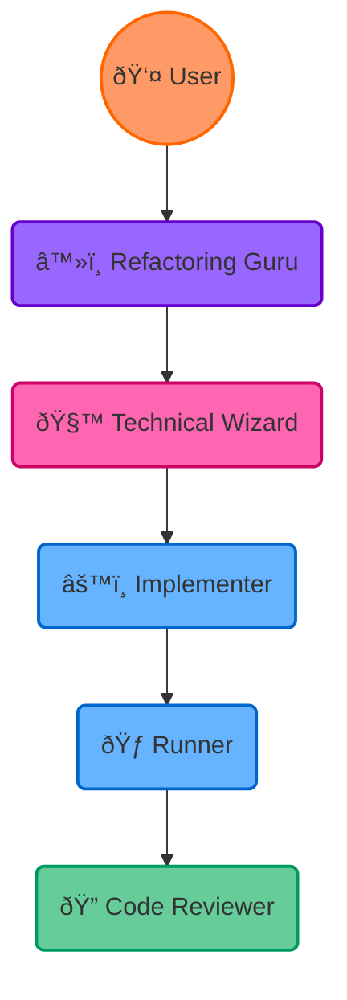
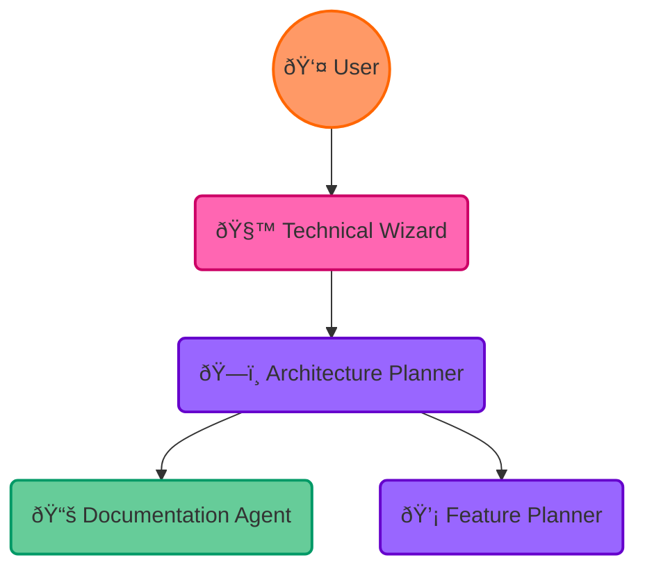

# Agent Workflows

> 📋 This guide provides practical examples of using the agent system in real-world scenarios.

## Overview

Agent workflows in crules are designed to help you tackle complex development tasks by combining specialized agents. Each agent has unique capabilities, and when used together in a workflow, they create a powerful development experience.

## Common Workflows

### Feature Development Workflow

The following workflow demonstrates how to use agents for developing a new feature:

```mermaid
sequenceDiagram
    participant User as 👤 User
    participant Wizard as 🧙 Technical Wizard
    participant Planner as 💡 Feature Planner
    participant Implementer as âš™ï¸ Implementer
    participant Runner as 🃠Runner
    participant Docs as 📚 Documentation

    User->>Wizard: Discuss feature idea
    Note over Wizard: Helps refine approach
    Wizard->>Planner: Hand off feature requirements
    Planner->>Implementer: Provide detailed implementation plan
    Implementer->>Runner: Implement code based on plan
    Runner->>User: Verify implementation
    User->>Docs: Request documentation
    Docs->>User: Deliver comprehensive docs

    style User fill:#ff9966,stroke:#ff6600
    style Wizard fill:#ff66b2,stroke:#cc0066
    style Planner fill:#9966ff,stroke:#6600cc
    style Implementer fill:#66b3ff,stroke:#0066cc
    style Runner fill:#66b3ff,stroke:#0066cc
    style Docs fill:#66cc99,stroke:#009966
```

#### Step-by-Step Procedure

1. Start with the **Technical Wizard** to discuss the feature at a high level:
   ```
   @wizard.mdc I need to implement a new feature that allows users to export their data in CSV format
   ```

2. Once you have a clear direction, consult the **Feature Planner**:
   ```
   @feature-planner.mdc Plan the implementation of the CSV export feature. The wizard suggested using a dedicated ExportService.
   ```

3. Take the plan to the **Implementer** for coding:
   ```
   @implementer.mdc Implement the CSV export feature based on this plan: [paste plan here]
   ```

4. Verify the implementation with the **Runner**:
   ```
   @runner.mdc Run tests for the new CSV export feature
   ```

5. Document the feature with the **Documentation Agent**:
   ```
   @documentation-agent.mdc Create user documentation for the new CSV export feature
   ```

### Bug Fix Workflow

For fixing bugs, follow this streamlined workflow:

```mermaid
sequenceDiagram
    participant User as 👤 User
    participant Fix as 🔧 Fix Planner
    participant Implementer as âš™ï¸ Implementer
    participant Runner as 🃠Runner
    participant Reviewer as 🔠Code Reviewer
    participant Committer as 📠Git Committer

    User->>Fix: Report bug
    Note over Fix: Analyzes root cause
    Fix->>Implementer: Provide fix strategy
    Implementer->>Runner: Implement solution
    Runner->>Reviewer: Verify fix
    Reviewer->>Committer: Approve changes
    Committer->>User: Create commit message

    style User fill:#ff9966,stroke:#ff6600
    style Fix fill:#9966ff,stroke:#6600cc
    style Implementer fill:#66b3ff,stroke:#0066cc
    style Runner fill:#66b3ff,stroke:#0066cc
    style Reviewer fill:#66cc99,stroke:#009966
    style Committer fill:#66cc99,stroke:#009966
```

#### Step-by-Step Procedure

1. Start with the **Fix Planner** to analyze the bug:
   ```
   @fix-planner.mdc Users report that the sorting function in the data table is not working correctly for date fields
   ```

2. Implement the fix with the **Implementer**:
   ```
   @implementer.mdc Fix the date sorting issue based on the analysis: [paste analysis here]
   ```

3. Verify the fix with the **Runner**:
   ```
   @runner.mdc Test the date sorting functionality
   ```

4. Review the code with the **Code Reviewer**:
   ```
   @code-reviewer.mdc Review my fix for the date sorting issue
   ```

5. Commit the changes with the **Git Committer**:
   ```
   @git-committer.mdc Create a commit message for fixing the date sorting issue
   ```

## Advanced Workflows

### Refactoring Workflow

For complex refactoring tasks:



### Architecture Planning Workflow

For designing system architecture:



## Real-World Examples

### Example 1: Adding a New API Endpoint

<details>
  <summary>📑 Click to view the complete workflow</summary>

  #### Technical Wizard Conversation
  ```
  User: I need to add a new API endpoint to our Express.js application that will handle user profile updates
  
  Wizard: For implementing a new API endpoint for user profile updates, I'd suggest the following approach:
  
  1. Determine what user profile fields will be updatable
  2. Define input validation for the endpoint
  3. Implement proper authentication and authorization
  4. Create the route handler in the Express application
  5. Update the user data in the database
  6. Add error handling and response formatting
  7. Write tests for the endpoint
  
  Would you like to proceed with this approach? I can help coordinate with other agents for implementation.
  ```

  #### Feature Planner Conversation
  ```
  User: Plan how to implement the user profile update endpoint as discussed with the wizard
  
  Feature Planner: # User Profile Update Endpoint Implementation Plan
  
  ## Requirements
  - Add a PATCH `/api/users/:userId/profile` endpoint
  - Allow updating name, email, avatar, and preferences
  - Require authentication
  - Validate input data
  - Return updated user profile on success
  
  ## Implementation Steps
  1. Add route definition in `routes/users.js`
  2. Create middleware for input validation
  3. Implement authorization check
  4. Create controller function in `controllers/users.js`
  5. Add database update logic in `models/User.js`
  6. Implement error handling
  7. Add unit and integration tests
  
  ## Detailed Specifications
  [Detailed specifications follow...]
  ```

  #### Implementer Conversation
  ```
  User: Implement the user profile update endpoint based on the planner's specifications
  
  Implementer: I'll implement the user profile update endpoint according to the plan.
  
  First, let's add the route in routes/users.js:
  [Code implementation details follow...]
  ```
</details>

### Example 2: Fixing a Performance Issue

<details>
  <summary>📑 Click to view the complete workflow</summary>

  #### Fix Planner Conversation
  ```
  User: Our application is experiencing slow load times on the dashboard page, especially when there are many data points
  
  Fix Planner: # Performance Issue Analysis
  
  ## Problem Description
  The dashboard page is loading slowly when displaying large datasets.
  
  ## Root Cause Analysis
  1. Inefficient data fetching - all data is being loaded at once
  2. No pagination implemented for large datasets
  3. Frontend rendering all data points simultaneously
  4. No caching mechanism in place
  
  ## Fix Strategy
  [Detailed fix strategy follows...]
  ```

  #### Implementer and Runner Conversations
  [Additional implementation and testing conversations...]
</details>

## Custom Workflow Creation

You can create your own custom workflows by chaining agents together in a way that best suits your development process.

### Workflow Design Tips

1. **Start High-Level**: Begin with the Technical Wizard or specialized planning agents
2. **Chain Specialized Agents**: Pass outputs between agents in a logical sequence
3. **Verify Results**: Always include verification steps with the Runner or Code Reviewer
4. **Document as You Go**: Involve the Documentation Agent throughout the process
5. **Use Feedback Loops**: Return to previous agents when needed for refinement

### Example Custom Workflow


## Performance Tips

- **Provide Context**: Give each agent the necessary context from previous steps
- **Be Specific**: Clearly describe the task for each agent
- **Share Relevant Code**: Include relevant code snippets or file references
- **Set Constraints**: Specify any limitations or requirements
- **Review and Iterate**: Review each agent's output before proceeding

## Interactive Examples

We've prepared some interactive examples to help you learn how to use agent workflows effectively:

<details>
  <summary>📺 View Feature Development Workflow Demo</summary>
  
</details>

<details>
  <summary>📺 View Bug Fix Workflow Demo</summary>
  
</details>

## Navigation

- Previous: [Advanced Usage](./advanced-usage.md)
- Up: [Examples](./README.md)
- Home: [Documentation Home](../README.md) 