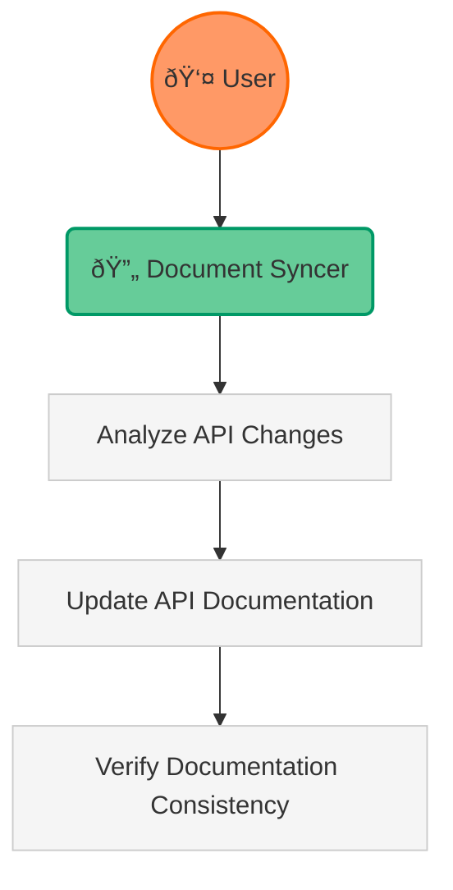
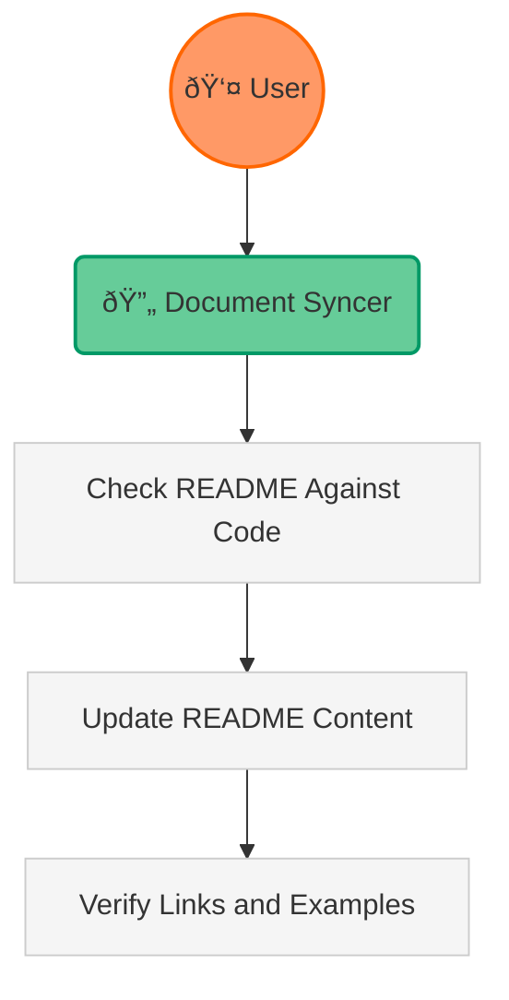

# Documentation Workflows

> 📋 This guide provides practical examples of using the Document Syncer agent in real-world scenarios.

## Overview

The Document Syncer agent in cursor++ is designed to help you maintain consistent documentation across your codebase. This guide shows practical workflows for common documentation tasks.

## Current Documentation Workflows

### Documentation Synchronization Workflow

The following workflow demonstrates how to use the Document Syncer agent to maintain consistency between code and documentation:

```mermaid
sequenceDiagram
    participant User as 👤 User
    participant DocSyncer as 🔄 Document Syncer
    
    User->>DocSyncer: Request consistency check
    Note over DocSyncer: Analyzes code and docs
    DocSyncer->>User: Report inconsistencies
    User->>DocSyncer: Request doc updates
    DocSyncer->>User: Propose changes
    User->>DocSyncer: Approve changes
    DocSyncer->>User: Apply approved changes

    style User fill:#ff9966,stroke:#ff6600
    style DocSyncer fill:#66cc99,stroke:#009966
```

#### Step-by-Step Procedure

1. Start with a consistency check:
   ```
   @doc-syncer.mdc Check for inconsistencies between our code and documentation
   ```

2. Review the report and request updates:
   ```
   @doc-syncer.mdc Update the documentation to match our current code implementation
   ```

3. Review proposed changes before approval:
   ```
   @doc-syncer.mdc Go ahead and implement the changes we discussed
   ```

### Documentation Migration Workflow

For migrating documentation between formats or systems:

```mermaid
sequenceDiagram
    participant User as 👤 User
    participant DocSyncer as 🔄 Document Syncer
    
    User->>DocSyncer: Request migration plan
    Note over DocSyncer: Analyzes current docs
    DocSyncer->>User: Propose migration strategy
    User->>DocSyncer: Approve strategy
    DocSyncer->>User: Execute migration
    DocSyncer->>User: Verify cross-references

    style User fill:#ff9966,stroke:#ff6600
    style DocSyncer fill:#66cc99,stroke:#009966
```

#### Step-by-Step Procedure

1. Start with planning the migration:
   ```
   @doc-syncer.mdc I need to migrate our Markdown documentation to a new format. Create a migration plan.
   ```

2. Review and approve the migration plan:
   ```
   @doc-syncer.mdc The migration plan looks good. Please proceed with the migration.
   ```

3. Verify the migration results:
   ```
   @doc-syncer.mdc Check that all documentation links and cross-references are working after the migration
   ```

## Specific Documentation Tasks

### Task 1: Updating API Documentation

When your API implementation changes, you need to update the documentation:



#### Example Conversation

```
User: @doc-syncer.mdc We've updated our API endpoints in the code, but our API documentation is now out of date.

Document Syncer: I'll help you synchronize your API documentation with the current implementation. First, I'll analyze the changes between your code and documentation.

[Agent analyzes code and documentation]

Document Syncer: I've identified several inconsistencies in your API documentation:
1. The '/users' endpoint now accepts 'email' as a query parameter, but this isn't documented
2. The response format for '/products' has changed to include a 'category' field
3. A new endpoint '/orders/status' exists in the code but isn't documented

Would you like me to update the API documentation to address these issues?

User: Yes, please update the documentation.

Document Syncer: Here's my proposed update to the API documentation:
[Detailed changes to API documentation]

Should I apply these changes?

User: The changes look good. Please apply them.

Document Syncer: I've updated your API documentation to match the current implementation. All endpoints and parameters are now correctly documented.
```

### Task 2: Synchronizing README Files

When your project evolves, you need to keep README files up-to-date:



#### Example Conversation

```
User: @doc-syncer.mdc Our main README.md file mentions commands and features that have changed. Please update it.

Document Syncer: I'll help you update your README.md file to reflect the current state of your project. First, I'll analyze the inconsistencies.

[Agent analyzes code and README]

Document Syncer: I've found several areas in the README.md that need updating:
1. The command syntax has changed from 'cursor++ agent list' to 'cursor++ agent'
2. It references agents that aren't implemented in the current version
3. The installation instructions are referencing an outdated version

Here's my proposed update to the README:
[Detailed changes to README.md]

Would you like me to apply these changes?

User: Yes, that looks correct. Please update the README.

Document Syncer: I've updated your README.md file to accurately reflect the current state of your project. All commands, features, and installation instructions are now up-to-date.
```

## Future Agent Extensions

In future releases, cursor++ will expand its agent ecosystem to include:

- **Documentation Agent**: Create new documentation from code
- **Document Reviewer Agent**: Review documentation for quality and completeness
- **Architecture Documenter Agent**: Create and maintain architecture documentation

Until these agents are available, the Document Syncer agent can help with many documentation tasks by focusing on synchronization between existing documentation and code.

## Navigation

- Previous: [Basic Usage](./basic-usage.md)
- Next: [Advanced Usage](./advanced-usage.md)
- Up: [Examples](../README.md#examples)
- Home: [Documentation Home](../README.md) 